# 2025年最佳23+加密货币自动交易工具（深度整理）

在加密货币市场，专业与新手交易者都在寻找更智能、更高效率的自动化交易方案。选用合适的加密货币自动交易工具，能够带来更稳定的策略部署、更广泛的交易平台覆盖，以及更低的人力成本。本文围绕加密货币自动交易系统、加密机器人、全自动策略等关键词，全面呈现今年最值得关注的自动化交易平台，助你轻松提升盈利效率。

***

## [Coinrule](https://coinrule.com)

一站式自动化交易平台，让用户无需编程即可设置、部署量化策略，适配多家主流交易所。

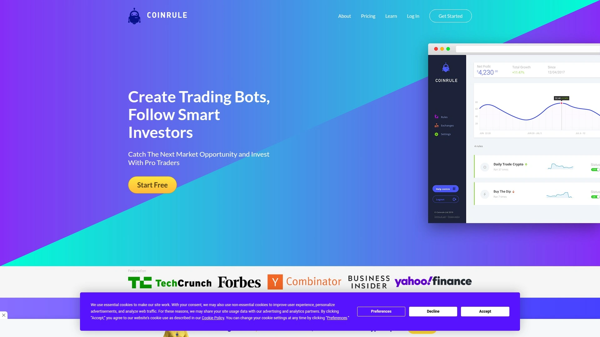

核心特色包括：可视化逻辑规则构建（IFTTT），250+策略模板，强劲的历史回测工具，实时报警提醒与多平台整合API接入。初学者可通过简单几步快速上手，资深用户则可深度自定义策略。云端托管降低运维门槛，更适合需要全天候运行的场景。同时支持免费试用。

***

## [3Commas](https://3commas.io)

灵活可定制的加密货币交易系统，支持多种策略方案与主流交易所一键接入。

拥有DCA、Grid等多类型交易机器，策略可基于技术指标深度开发及回测，适合对自动化和个性化需求高的用户。风险管理工具丰富，可设置止盈/止损和追踪止损，保障资金安全。支持免费/付费多档套餐，适用于初学者及专业量化团队。

***

## [Cryptohopper](https://www.cryptohopper.com)

全球领先的加密货币全天候自动交易软件，内置AI策略分析及专业交易员跟单功能。

特色包括：云托管服务，多平台兼容（如Binance、Coinbase Pro、KuCoin等），丰富策略模板和自定义选项，风险管理（如DCA、止损、追踪止损）系统完善。无需专业背景也能快速上手，用户可随时跟踪账户状态、主控全局。

***

## [Pionex](https://www.pionex.com)

集成16+自动交易机器人的加密货币交易所，覆盖主流币种与现货市场。

内置免费Grid、DCA等机器人，低门槛适配多种交易策略，适合注重易用性的用户。平台手续费极低，交易环境安全合规，适合长线稳健投资者与频繁交易者。

***

## [Bitsgap](https://bitsgap.com)

跨平台交易及套利管理工具，聚合多家交易所，自动化策略丰富。

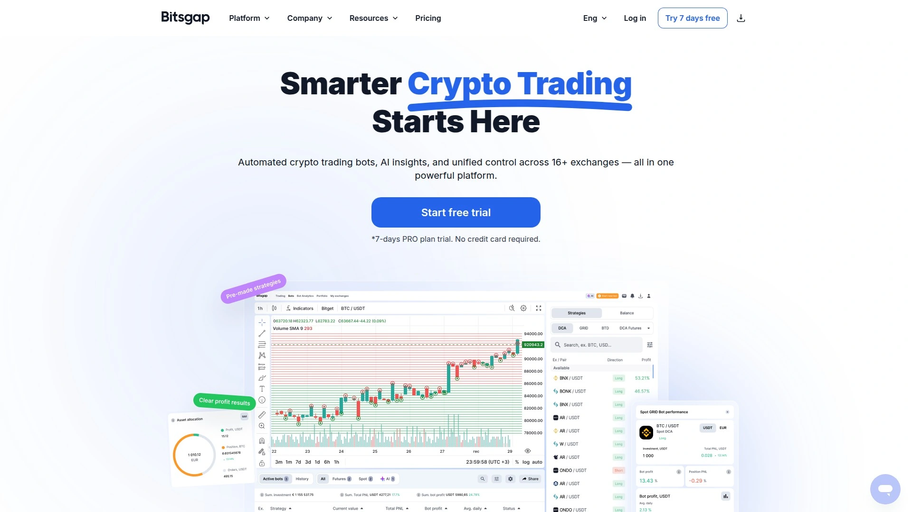

支持多币种智能套利、Grid机器人、订单追踪等功能，界面直观易操作。适合有多家交易所有资产、需统一管理及自动化执行交易的用户。

***

## [TradeSanta](https://tradesanta.com)

快速部署量化交易机器人的一站式平台，支持主流交易所及可视化移动端操作。

提供多策略选择与实时行情对接，上手门槛低，尤其适合新手及需要移动端便捷管理的用户。

***

## [HaasOnline](https://haasonline.com)

专业量化交易软件，支持强大定制与本地化部署。

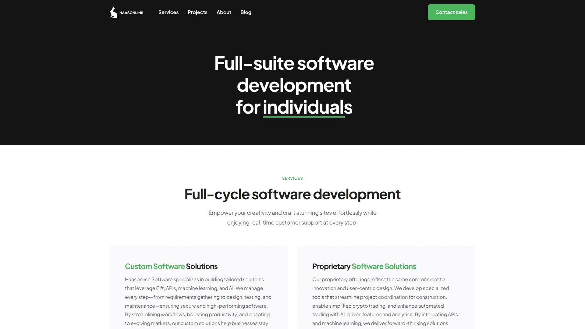

开放API，用户可自由开发个性化策略，适配多市场、复杂逻辑需求。界面偏专业，需要一定金融或编程基础。

***

## [Quadency](https://quadency.com)

多功能数字资产管理与交易自动化平台。

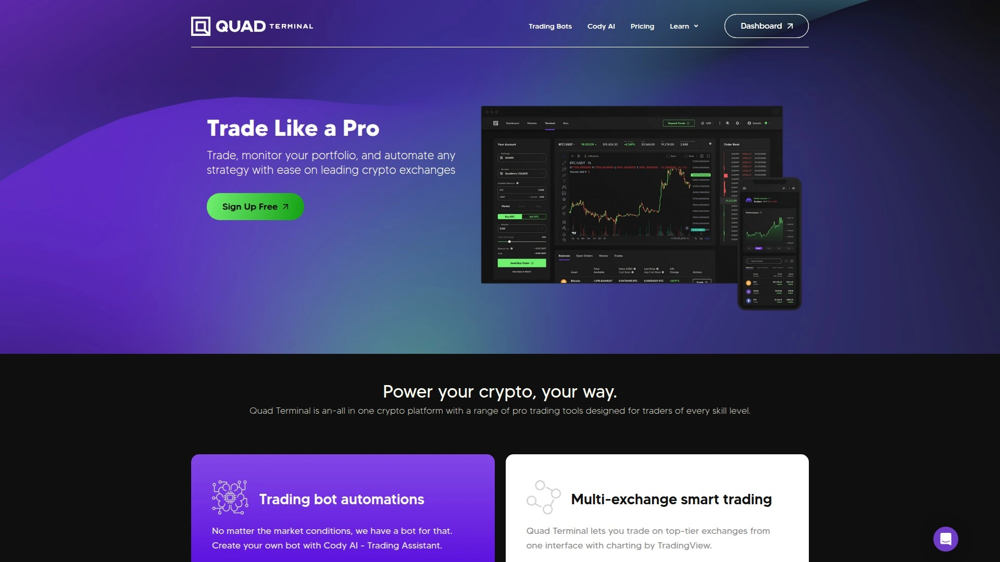

支持统一管理多平台行情、设置自动化策略，功能涵盖投资组合分析、自动买卖、风控等，适合需要资产一站式管理的用户。

***

## [Shrimpy](https://www.shrimpy.io)

偏向资产再平衡与多账户聚合的自动化平台。

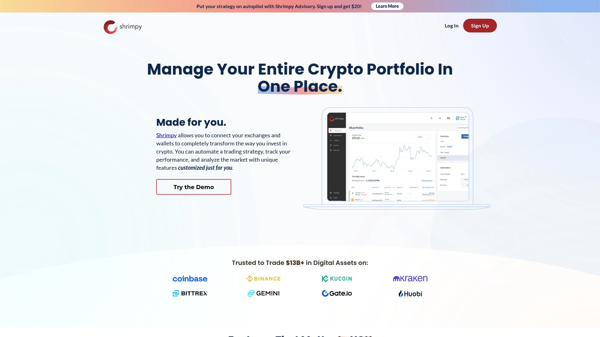

除了自动交易，还能自动跟踪资产分配、设定多账户统一策略，利于长期规划与合约/现货混合配置。

***

## [Zignaly](https://zignaly.com)

提供专业社交交易服务和自动化机器人，支持跟单及策略自定义。

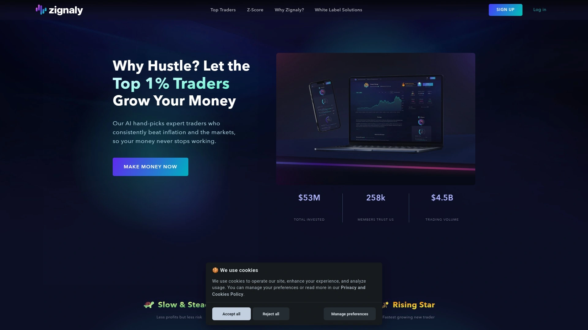

适合希望借助社区力量，快速获取有效策略并自动跟单执行的用户，支持多平台互通。

***

## [NapBots](https://napbots.com)

主打定期自动再配置的量化机器人平台，支持多种周期与策略组合。

用户可选择高频/低频调整，适合希望解放人力、降低操作频率的投资者。

***

## [CryptoHero](https://cryptohero.ai)

AI智能驱动的自动化交易平台，适配主流交易所和资产类别。

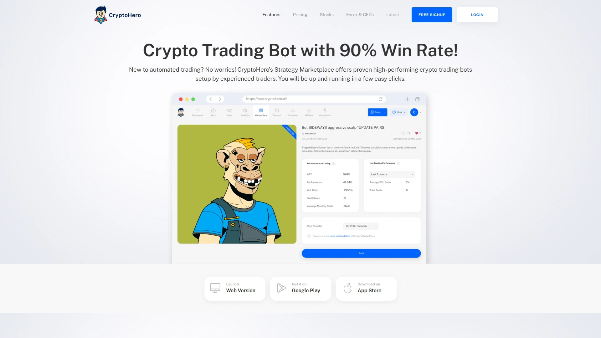

平台支持多样化策略设置，内含模拟盘和实时推送，便于持续优化和新手练习。

***

## [Kryll](https://kryll.io)

可视化拖拽式自动化交易引擎，助力无代码策略编排。

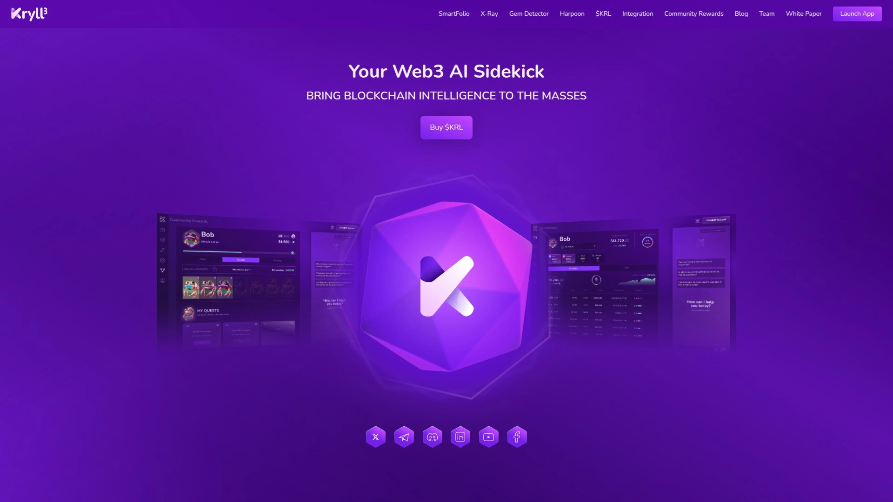

提供社区策略库、实时回测和API集成，适合希望自行探索并灵活切换策略的用户。

***

## [Altrady](https://altrady.com)

高性能多交易所管理及自动化交易工具。

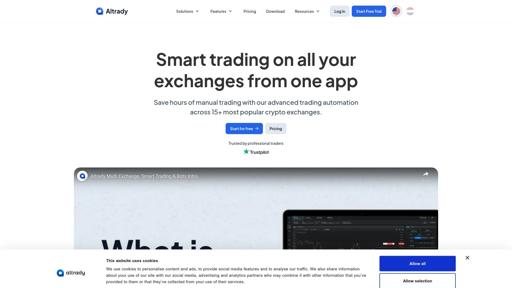

聚合账户资产自动同步、内置智能机器人，界面简洁易上手，适合高频且多资产管理需求的投资者。

***

## [Stoic](https://stoic.ai)

AI算法驱动的自动化量化投资机器人。

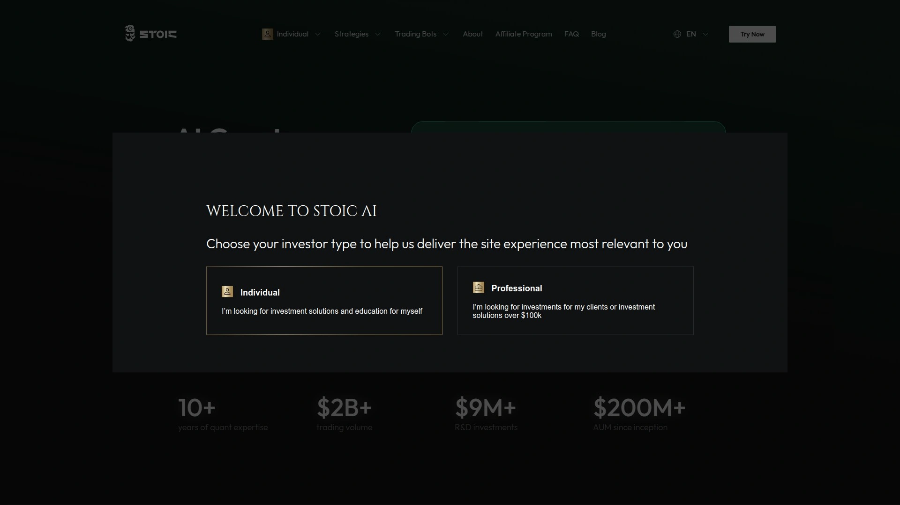

一键启动，自动配置资产组合，偏好长期被动增长，适合不希望频繁操作但想稳定收益的用户。

***

## [Gunbot](https://gunbot.com)

面向高级用户的自定义自动化交易软件，可本地部署并深度自定义策略。

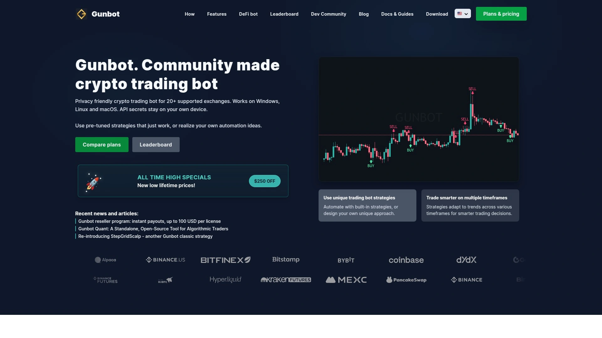

最大特色在于灵活参数设定，适合编程与金融背景用户，支持多种市场和复杂操作。

***

## [Coinigy](https://www.coinigy.com)

金融级别多交易所数据聚合和自动化工具。

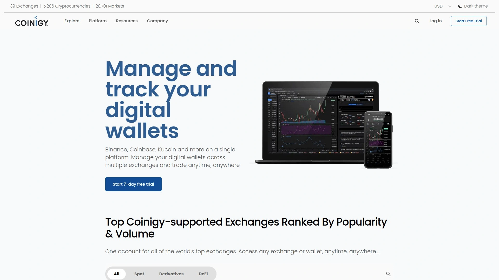

可实现多平台统一管理、自动执行订单，适合专业投资团队和高资产用户。

***

## [Mudrex](https://mudrex.com)

主打策略广场与自动化投资组合的量化机器人平台。

用户可复制成熟策略，或创建自有自动机器人，适合想要多样选择和轻松上手的新手用户。

***

## [Botsfolio](https://botsfolio.com)

零编程自动化交易平台，主打全程托管和无忧投资体验。

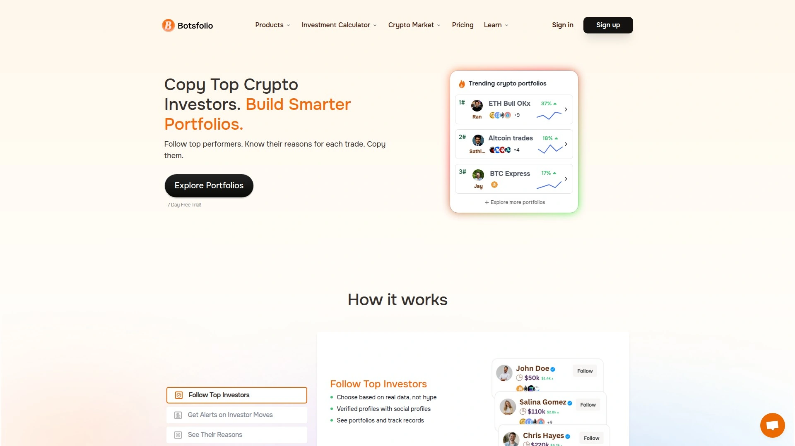

根据用户风险偏好自动调配策略，适合需长期稳健收益的投资者。

***

## [TokenSets](https://www.tokensets.com)

聚合多种自动化交易与资产组合，强调去中心化操作与智能合约部署。

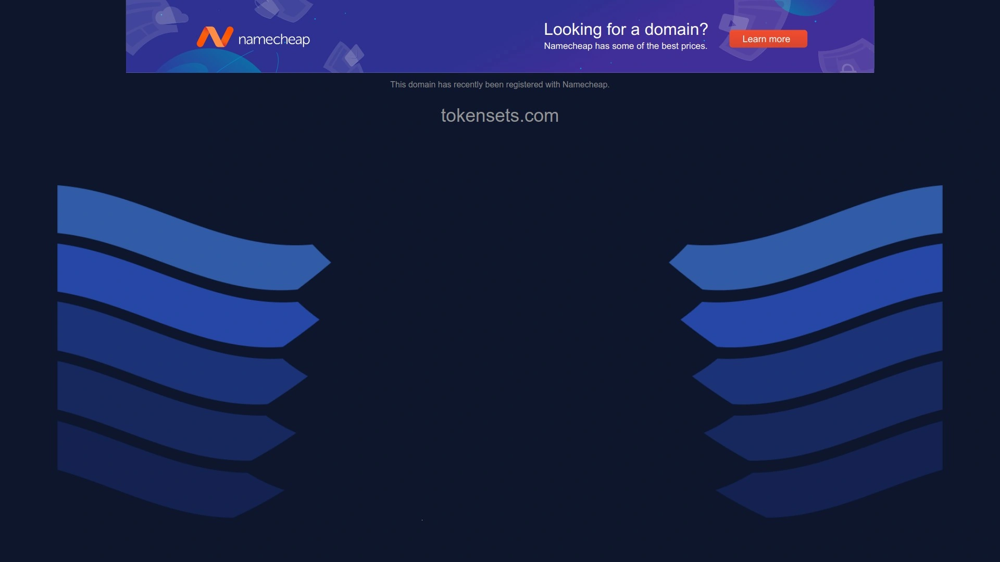

适合偏好DeFi生态与主动型资产管理的用户，便捷进行组合再平衡和安全托管。

***

## [RevenueBot](https://revenuebot.io)

专注Grid与套利策略自动化部署。

最低入门门槛，平台已集成多种策略选择，适合偏好频繁交易和网格套利的用户。

***

## [Bots.live](https://www.bots.live)

实时自动化交易机器人商店，多平台兼容。

平台提供多策略一键选购与托管，适合快速部署及无需技术背景的用户。

***

## [Capitual](https://capitual.com)

新增场景币自动化交易与资产管理工具。

适合本地支付与全球数字资产混合管理，自动化配置灵活，适合跨境投资人群。

***

## FAQ

**加密货币自动交易工具是否适合新手？**
大部分主流平台设计有可视化操作和预设策略模板，如Coinrule和Cryptohopper，初学者可以快速部署，无需编程基础。

**如何评估自动交易效果？**
建议先用历史回测功能（如Coinrule、3Commas均有提供），观察模拟盈利及实际行情匹配度，进一步用模拟盘或小规模实盘验证。

**支持哪些主流交易所？**
主流自动交易平台均支持币安、Coinbase、KuCoin、OKX等，部分还支持DeFi链上交易与多交易所同步操作。

***

## 总结

选择合适的加密货币自动交易工具，有助于实现更高效资产增长与操作效率。本文推荐榜单全部适配主流交易场景，其中[Coinrule](#coinrule)特别适合新手及希望全场景覆盖的用户，凭借无代码易用性、丰富策略库和多平台整合，更稳更快完成自动化资产管理目标。
